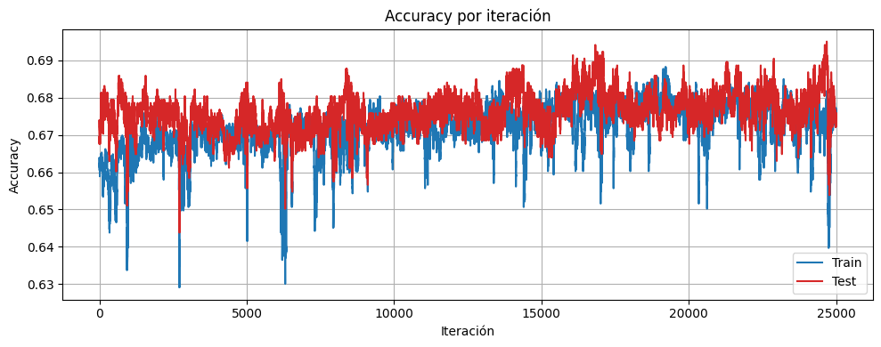
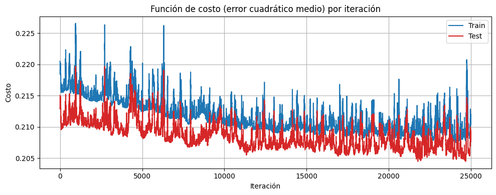
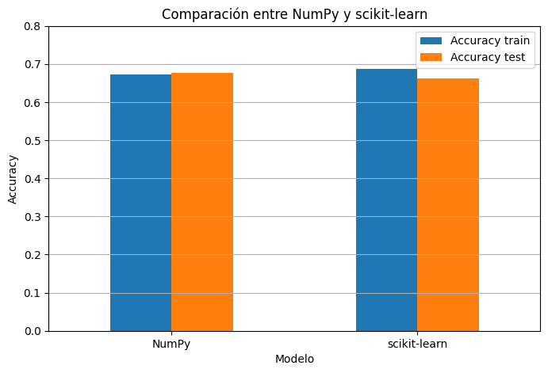
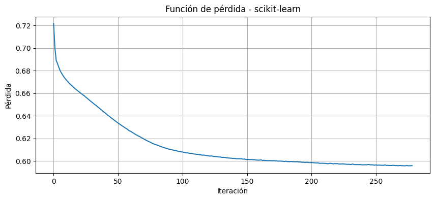
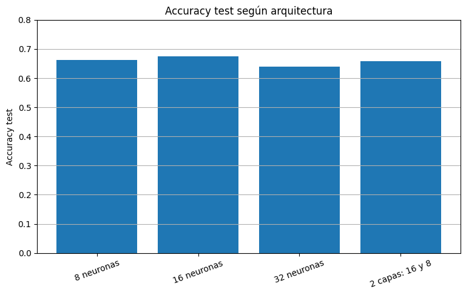

# Informe — Parte 1: Análisis de la base de datos

**Trabajo Práctico — Matemática III: Redes Neuronales**  
**Dataset:** Water Potability  
**Fuente:** https://www.kaggle.com/datasets/adityakadiwal/water-potability  
**Integrantes:** Micaela Ortiz y Camila Maldonado

---

## Introducción

Se eligió la base de datos **Water Potability**, disponible en Kaggle. Contiene mediciones físico-químicas de muestras de agua y una variable objetivo binaria que indica si el agua es apta para el consumo humano. El objetivo de esta primera parte es analizar el dataset antes de utilizarlo para entrenar una red neuronal de clasificación: describir las variables, estudiar su relación con la variable objetivo, detectar outliers y valores faltantes, y definir una estrategia de normalización.

El dataset contiene **3.276 registros** y **10 columnas**: 9 variables de entrada numéricas y 1 variable objetivo binaria.

---

## (a) Descripción de las columnas

Todas las variables de entrada son **numéricas continuas** de tipo `float64`. No hay variables categóricas ni de texto, por lo que no fue necesario aplicar ningún tipo de codificación (como one-hot encoding).

| Columna | Tipo | Descripción |
|---|---|---|
| `ph` | Numérica continua | Nivel de pH del agua. Rango teórico: 0 a 14. El rango seguro según la OMS para agua potable es entre 6.5 y 8.5. Tiene **491 valores faltantes**. |
| `Hardness` | Numérica continua | Dureza del agua en mg/L. Mide la cantidad de calcio y magnesio disueltos. Sin valores faltantes. |
| `Solids` | Numérica continua | Sólidos totales disueltos en ppm. Es la variable con mayor magnitud numérica del dataset (valores en el orden de los miles). Sin valores faltantes. |
| `Chloramines` | Numérica continua | Concentración de cloraminas en ppm. Se usan como desinfectante en el tratamiento del agua. Sin valores faltantes. |
| `Sulfate` | Numérica continua | Concentración de sulfatos en mg/L. Tiene **781 valores faltantes**, la mayor cantidad del dataset (23.84%). |
| `Conductivity` | Numérica continua | Conductividad eléctrica del agua en μS/cm. Indica la cantidad de iones disueltos. Sin valores faltantes. |
| `Organic_carbon` | Numérica continua | Carbono orgánico total en ppm. Mide la cantidad de compuestos orgánicos presentes en el agua. Sin valores faltantes. |
| `Trihalomethanes` | Numérica continua | Concentración de trihalometanos en μg/L. Son subproductos del proceso de desinfección del agua. Tiene **162 valores faltantes**. |
| `Turbidity` | Numérica continua | Turbidez del agua en NTU. Mide la claridad del agua. Sin valores faltantes. |
| `Potability` | Binaria (target) | Variable objetivo. `1` indica agua potable y `0` indica agua no potable. |

La distribución de la variable objetivo es la siguiente:

| Clase | Significado | Cantidad | Porcentaje |
|---|---|---:|---:|
| 0 | No potable | 1998 | 60.99% |
| 1 | Potable | 1278 | 39.01% |

Existe un leve desbalance de clases (61% / 39%). Este desbalance es moderado y no representa un problema crítico para el entrenamiento, ya que ambas clases tienen representación suficiente. Sin embargo, se recomienda evaluar el modelo con métricas que sean sensibles al desbalance, como F1-score o AUC-ROC, y no solo con accuracy, ya que un modelo que prediga siempre "no potable" obtendría un 61% de accuracy sin haber aprendido nada.

---

## (b) Correlación de las características con la salida

Para analizar la relación entre las variables de entrada y la variable objetivo se utilizaron dos enfoques complementarios: la **correlación de Pearson** y la **información mutua**.

Antes del cálculo, los valores faltantes fueron imputados con la mediana de cada columna (ver sección d).

### Correlación de Pearson

El coeficiente de Pearson mide la relación **lineal** entre dos variables. Toma valores entre -1 y 1, donde valores cercanos a 0 indican ausencia de relación lineal.

| Variable | Correlación con `Potability` |
|---|---:|
| `Solids` | 0.034 |
| `Chloramines` | 0.024 |
| `Trihalomethanes` | 0.007 |
| `Turbidity` | 0.002 |
| `ph` | -0.004 |
| `Conductivity` | -0.008 |
| `Hardness` | -0.014 |
| `Sulfate` | -0.024 |
| `Organic_carbon` | -0.030 |

Ninguna variable presenta una correlación lineal significativa con la variable objetivo. Todos los valores se encuentran entre -0.03 y 0.03.

### Información mutua

Dado que las correlaciones lineales son todas prácticamente nulas, se complementó el análisis con la **información mutua**, que detecta relaciones no lineales entre variables. Un valor de 0 indica independencia estadística; valores mayores indican mayor dependencia.

| Variable | Información mutua |
|---|---:|
| `Hardness` | 0.0266 |
| `Conductivity` | 0.0071 |
| `Organic_carbon` | 0.0040 |
| `Turbidity` | 0.0031 |
| `Sulfate` | 0.0024 |
| `Solids` | 0.0011 |
| `ph` | 0.0002 |
| `Chloramines` | 0.0000 |
| `Trihalomethanes` | 0.0000 |

Los valores de información mutua también son muy bajos en todas las variables. `Hardness` es la que presenta la mayor dependencia con `Potability`, aunque sigue siendo un valor muy pequeño.

### Interpretación

Ninguna variable individual se destaca como claramente influyente sobre la potabilidad, ni de forma lineal ni no lineal. Esto no significa que las variables sean irrelevantes: lo que indica es que la relación entre las propiedades físico-químicas y la potabilidad es **compleja y multivariada**, es decir, depende de la combinación de varias variables simultáneamente y no de ninguna en particular. Esta característica es precisamente la que justifica el uso de una red neuronal, que es capaz de capturar ese tipo de interacciones no lineales entre variables.

También se verificó que las variables de entrada son prácticamente independientes entre sí: el único par con correlación superior a 0.10 es `Solids` y `Sulfate` (r = -0.15), lo que confirma que no hay redundancia significativa en el dataset y que todas las columnas aportan información distinta.

---

## (c) Factibilidad para una red neuronal de clasificación binaria

**¿Es esta base de datos adecuada?**

Sí, el dataset es adecuado por varias razones:

- La variable objetivo `Potability` es estrictamente binaria (valores 0 y 1), lo que se alinea directamente con la arquitectura de una red neuronal de clasificación binaria con una sola neurona de salida y función de activación sigmoide.
- Todas las variables de entrada son numéricas continuas, lo que facilita el preprocesamiento (no requiere codificación) y es compatible con cualquier arquitectura de red neuronal.
- El dataset contiene datos reales de mediciones físico-químicas, lo que garantiza que los patrones aprendidos correspondan a relaciones reales del mundo.
- Aunque las correlaciones individuales con la variable objetivo son bajas, esto no invalida el dataset: una red neuronal puede capturar relaciones no lineales y combinaciones entre variables que métodos lineales no detectan.

**¿Qué intentará predecir el modelo?**

El modelo recibirá como entrada las 9 mediciones físico-químicas de una muestra de agua y producirá como salida un valor entre 0 y 1 que representa la probabilidad de que esa muestra sea potable. Si el valor supera 0.5 se clasifica como potable (1); de lo contrario, como no potable (0).

**¿Cuál es el objetivo?**

Construir un clasificador que, a partir de mediciones físico-químicas, determine si una muestra de agua es apta para el consumo humano. Este tipo de modelo tiene aplicación real en sistemas de monitoreo de calidad del agua en plantas de tratamiento o redes de distribución.

---

## (d) Identificación de datos atípicos y limpieza

### Valores faltantes

Se detectaron valores faltantes en tres columnas:

| Variable | Valores faltantes | Porcentaje |
|---|---:|---:|
| `ph` | 491 | 14.99% |
| `Sulfate` | 781 | 23.84% |
| `Trihalomethanes` | 162 | 4.95% |

Se decidió **imputar estos valores con la mediana de cada columna** en lugar de eliminar las filas correspondientes. Eliminar las filas implicaría perder hasta un 24% del dataset, lo que reduciría significativamente la cantidad de datos disponibles para el entrenamiento. Se eligió la **mediana** en lugar del promedio porque es más robusta ante la presencia de outliers: no se ve afectada por valores extremos como sí lo hace la media.

Luego de la imputación, el dataset quedó sin valores faltantes en ninguna columna.

### Detección de outliers

Se aplicó el método del **rango intercuartílico (IQR)** para detectar outliers. Este método define los límites fuera de los cuales un valor se considera atípico:

- Límite inferior = Q1 − 1.5 × IQR  
- Límite superior = Q3 + 1.5 × IQR

donde Q1 es el percentil 25, Q3 el percentil 75 e IQR = Q3 − Q1.

Los resultados fueron:

| Variable | Límite inferior | Límite superior | Outliers detectados | % del total |
|---|---:|---:|---:|---:|
| `ph` | 3.89 | 10.26 | 142 | 4.3% |
| `Hardness` | 117.13 | 276.39 | 83 | 2.5% |
| `Solids` | −1832.42 | 44831.87 | 47 | 1.4% |
| `Chloramines` | 3.15 | 11.10 | 61 | 1.9% |
| `Sulfate` | 267.16 | 400.32 | 264 | 8.1% |
| `Conductivity` | 191.65 | 655.88 | 11 | 0.3% |
| `Organic_carbon` | 5.33 | 23.30 | 25 | 0.8% |
| `Trihalomethanes` | 26.62 | 106.70 | 54 | 1.6% |
| `Turbidity` | 1.85 | 6.09 | 19 | 0.6% |

**¿Es necesario limpiarlos?**

Se decidió **no eliminar** los outliers por las siguientes razones:

1. Representan mediciones físico-químicas reales que pueden ocurrir naturalmente en distintas fuentes de agua. Un agua con pH extremo, alta concentración de sulfatos o muchos sólidos disueltos es perfectamente posible en la naturaleza y no indica un error de medición.
2. La variable más afectada es `Sulfate` con un 8.1% de outliers, y el resto no supera el 5%. Eliminar todas las filas con outliers implicaría descartar una proporción significativa del dataset.
3. La normalización Z-score aplicada en la sección siguiente reduce el impacto de estos valores extremos, llevando todas las variables a una escala comparable sin eliminar información real.

---

## (e) Normalización de los datos

Dado que todas las variables de entrada son numéricas con escalas muy distintas entre sí, es necesario normalizarlas antes del entrenamiento. Por ejemplo, `Solids` toma valores en el orden de los miles mientras que `Turbidity` toma valores menores a 7. Sin normalización, la red neuronal podría asignarle mayor importancia a variables con mayor magnitud numérica aunque no sean más relevantes para la predicción. Además, la normalización facilita la convergencia del algoritmo de descenso por gradiente.

**La variable objetivo `Potability` no se normaliza**, ya que es binaria (0 o 1) y cumple su función directamente como etiqueta de clase.

### Método elegido: estandarización Z-score

Se aplicó la estandarización Z-score a las 9 variables de entrada mediante la fórmula:

z = (x − μ) / σ

donde μ es la media y σ el desvío estándar de cada columna. Este método transforma cada variable para que quede con **media 0 y desvío estándar 1**.

Se eligió Z-score en lugar de Min-Max por dos razones:

1. El dataset presenta outliers en todas las columnas. El método Min-Max es muy sensible a valores extremos: al comprimir todos los valores al rango [0, 1], los outliers distorsionan la escala de toda la columna. El Z-score en cambio reescala los valores manteniendo la distribución original.
2. El Z-score es el método recomendado para redes neuronales entrenadas con descenso por gradiente, porque produce entradas centradas en cero, lo que favorece la estabilidad numérica del entrenamiento.

La normalización se implementa sobre el conjunto de entrenamiento y los parámetros (media y desvío) obtenidos se aplican también al conjunto de validación y prueba, para evitar data leakage.

### División del dataset

Antes del entrenamiento, el dataset se dividirá en conjunto de entrenamiento (80%) y conjunto de prueba (20%), de forma **estratificada** para preservar la proporción de clases en ambos subconjuntos. Esta división se realizará en la Parte 2.

### Resultado final

Luego del preprocesamiento, las 9 variables de entrada quedan con media ≈ 0 y desvío estándar = 1. La matriz de entrada X tiene shape **(3276, 9)** y la variable objetivo y tiene shape **(3276, 1)**. El dataset queda listo para el entrenamiento de la red neuronal.

## -------------------------------------------

# Parte 2: Red Neuronal con Numpy

## Objetivo

En esta parte se implementó una red neuronal de clasificación binaria utilizando `numpy`. El objetivo del modelo es predecir la variable `Potability`, que indica si una muestra de agua es potable (`1`) o no potable (`0`).

## (a) Arquitectura de la red

La red neuronal implementada tiene una arquitectura feedforward con una capa oculta y una capa de salida.

| Capa | Cantidad de neuronas | Función de activación |
|---|---:|---|
| Entrada | 9 | No aplica |
| Capa oculta | 8 | ReLU |
| Salida | 1 | Sigmoide |

La capa de entrada tiene 9 neuronas porque el dataset conserva 9 variables físico-químicas como características de entrada: `ph`, `Hardness`, `Solids`, `Chloramines`, `Sulfate`, `Conductivity`, `Organic_carbon`, `Trihalomethanes` y `Turbidity`.

La capa oculta tiene 8 neuronas. Se eligió una arquitectura simple para evitar un modelo demasiado grande respecto del tamaño del dataset y para mantener una implementación clara con `numpy`.

La función de activación elegida para la capa oculta fue **ReLU**:

```text
ReLU(x) = max(0, x)
```

Esta función introduce no linealidad y permite que la red aprenda relaciones más complejas que una clasificación lineal.

La capa de salida tiene una única neurona con función de activación **sigmoide**:

```text
sigmoide(x) = 1 / (1 + e^(-x))
```

Esta función devuelve un valor entre 0 y 1, interpretable como la probabilidad de que la muestra de agua sea potable. Para obtener la clase predicha, se utiliza un umbral de 0.5.

## (b) Implementación con numpy

La red neuronal fue implementada utilizando `numpy`. Los pasos principales fueron:

1. Inicialización aleatoria de pesos y sesgos.
2. Cálculo de las activaciones mediante propagación hacia adelante.
3. Cálculo del error.
4. Retropropagación para obtener los gradientes.
5. Actualización de pesos y sesgos mediante descenso por gradiente.

Antes de entrenar, se realizó el preprocesamiento de los datos. Las columnas `ph`, `Sulfate` y `Trihalomethanes` tenían valores faltantes, por lo que fueron completadas con la mediana de cada columna. Luego, todas las variables de entrada fueron normalizadas mediante Z-score para que quedaran en escalas comparables.

La separación entre entrenamiento y prueba se realizó con `train_test_split`, usando aproximadamente dos tercios de los datos para entrenamiento y un tercio para prueba. Se fijó `random_state=42` para que la partición fuera reproducible.

El entrenamiento se realizó seleccionando una muestra aleatoria del conjunto de entrenamiento en cada iteración. A partir de esa muestra se calcularon las salidas de la red, se aplicó retropropagación y se actualizaron los parámetros. Se utilizó `seed=10` para la inicialización de los pesos y la selección aleatoria de muestras.

La función de costo utilizada fue el **error cuadrático medio**:

```text
MSE = promedio((y_predicho - y_real)^2)
```

Además, en cada iteración se registraron la accuracy y el costo tanto para el conjunto de entrenamiento como para el conjunto de prueba.

## (c) Entrenamiento y curvas de rendimiento

Durante el entrenamiento se registraron las curvas de accuracy y función de costo para los conjuntos de entrenamiento y prueba.





La accuracy del modelo se mantuvo aproximadamente entre 0.66 y 0.68 en el conjunto de prueba. Con `seed=10`, el resultado final fue:

| Métrica | Valor |
|---|---:|
| Accuracy train | 0.6726 |
| Accuracy test | 0.6758 |

Para analizar si la red realmente aprendió, se comparó su rendimiento con un modelo base. En el conjunto de prueba, la clase mayoritaria representa aproximadamente el 62.64% de los datos. Por lo tanto, un clasificador trivial que predijera siempre la clase mayoritaria tendría una accuracy de 0.6264.

La red neuronal supera ese baseline, ya que obtuvo una accuracy test de 0.6758. Esto indica que el modelo logró aprender ciertos patrones de los datos. Sin embargo, la mejora es moderada, con una diferencia de aproximadamente 5 puntos porcentuales respecto del baseline.

También se probó el efecto de cambiar la semilla aleatoria, manteniendo fija la partición train/test. Los resultados finales fueron:

| Seed | Accuracy train | Accuracy test |
|---:|---:|---:|
| 10 | 0.6726 | 0.6758 |
| 30 | 0.6891 | 0.6621 |
| 42 | 0.6841 | 0.6538 |

A partir de esta comparación, se decidió conservar `seed=10`, ya que obtuvo el mejor rendimiento en test y una diferencia menor entre entrenamiento y prueba. Esto sugiere una mejor capacidad de generalización que las otras semillas evaluadas.

Las curvas presentan oscilaciones porque el entrenamiento se realiza con una muestra aleatoria por iteración, es decir, mediante descenso por gradiente estocástico. Este comportamiento es esperable en este tipo de entrenamiento.

## (d) Análisis de overfitting

A partir de las curvas de accuracy y costo, no se observa un sobreajuste extremo. La accuracy de entrenamiento y la accuracy de prueba se mantienen en valores cercanos, especialmente con `seed=10`.

Sin embargo, al probar distintas semillas se observó que algunas configuraciones obtienen mayor accuracy en entrenamiento pero menor accuracy en prueba. Por ejemplo, con `seed=30` la accuracy train fue 0.6891, mientras que la accuracy test bajó a 0.6621. Esto sugiere que el modelo puede volverse sensible a la inicialización de pesos y no siempre generaliza de la misma manera.

Para manejar este posible sobreajuste o variabilidad se podrían aplicar distintas estrategias:

- Detener el entrenamiento en el punto donde la accuracy de prueba deja de mejorar.
- Probar distintas tasas de aprendizaje.
- Reducir o ajustar la cantidad de neuronas en la capa oculta.
- Evaluar otras métricas además de accuracy, como precision, recall o F1-score.
- Comparar con una implementación en `scikit-learn`, como se realiza en la Parte 3.

En conclusión, el modelo aprende de forma moderada y supera el baseline de la clase mayoritaria. Sin embargo, el dataset no presenta una separación sencilla entre las clases, lo cual es coherente con el análisis exploratorio, donde las variables físico-químicas no mostraban correlaciones muy fuertes con la variable objetivo.

## -------------------------------------------

# Parte 3: Comparación con scikit-learn

## Objetivo

En esta parte se implementó una red neuronal utilizando `scikit-learn` para comparar su rendimiento con la red implementada manualmente en `numpy`.

## (a) Implementación con scikit-learn

Se utilizó `MLPClassifier` para construir una red neuronal con una arquitectura similar a la desarrollada en la Parte 2.

| Capa | Cantidad de neuronas | Función de activación |
|---|---:|---|
| Entrada | 9 | No aplica |
| Capa oculta | 8 | ReLU |
| Salida | 1 | Sigmoide |

Se aplicó el mismo preprocesamiento que en la Parte 2: imputación de valores faltantes con la mediana, normalización Z-score y separación entre entrenamiento y prueba con `test_size = 1/3`.

El conjunto de entrenamiento quedó formado por 2184 muestras y el conjunto de prueba por 1092 muestras.

## (b) Comparación de rendimiento

Los resultados obtenidos fueron:

| Modelo | Accuracy train | Accuracy test |
|---|---:|---:|
| NumPy | 0.6726 | 0.6758 |
| scikit-learn | 0.6873 | 0.6630 |



Ambos modelos utilizan una arquitectura similar, con una capa oculta de 8 neuronas y función de activación ReLU. La implementación con `scikit-learn` obtuvo una accuracy de entrenamiento levemente mayor que la implementación en `numpy`, pero un accuracy de prueba menor.

Esto indica que, para esta configuración, el modelo de `scikit-learn` ajustó un poco más los datos de entrenamiento, pero no generalizó mejor sobre el conjunto de prueba. La diferencia entre ambos modelos no es muy grande, por lo que puede concluirse que tienen un rendimiento similar.

La implementación manual en `numpy` permite comprender mejor el funcionamiento interno de la red neuronal, ya que requiere programar la propagación hacia adelante, la retropropagación y la actualización de pesos. En cambio, `scikit-learn` permite construir y entrenar redes neuronales de forma más simple y rápida.

La curva de pérdida del modelo implementado con `scikit-learn` muestra una disminución progresiva del error durante el entrenamiento:



## (c) Prueba de otras arquitecturas

También se probaron distintas arquitecturas modificando la cantidad de neuronas y capas ocultas. Los resultados fueron:

| Arquitectura | Accuracy train | Accuracy test |
|---|---:|---:|
| 8 neuronas | 0.6873 | 0.6630 |
| 16 neuronas | 0.7065 | 0.6749 |
| 32 neuronas | 0.7482 | 0.6401 |
| 2 capas: 16 y 8 | 0.7518 | 0.6575 |



La arquitectura con 16 neuronas en una capa oculta obtuvo el mejor resultado en el conjunto de prueba, con una accuracy de 0.6749. Este valor es muy cercano al obtenido por la red implementada manualmente en `numpy`. 
Aunque la arquitectura de 16 neuronas obtuvo un resultado levemente mejor dentro de las pruebas realizadas con `scikit-learn`, no se modificó la implementación manual de la Parte 2. Se decidió mantener la red de `numpy` con 8 neuronas para conservar una arquitectura simple y comparable con la implementación base.

La exploración con `scikit-learn` se utilizó justamente para analizar de forma rápida cómo cambiaba el rendimiento al variar la cantidad de neuronas o capas. Dado que la mejora con 16 neuronas fue pequeña, no se consideró necesario rehacer la implementación manual.

En cambio, las arquitecturas más grandes, como la de 32 neuronas o la de dos capas ocultas, obtuvieron mayor accuracy en entrenamiento pero menor accuracy en prueba. Esto sugiere que aumentar la complejidad del modelo no necesariamente mejora la generalización y puede llevar a cierto sobreajuste.

En conclusión, `scikit-learn` facilita la implementación y comparación de distintas redes neuronales. Sin embargo, en este dataset las mejoras obtenidas al modificar la arquitectura son moderadas. Esto refuerza la idea observada en las partes anteriores: la potabilidad del agua no parece separarse fácilmente a partir de estas variables físico-químicas, por lo que el rendimiento de los modelos se mantiene en valores cercanos.

# Parte 4: Conclusión