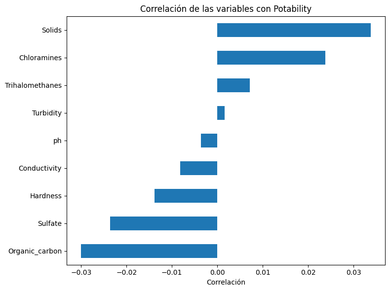

# Informe - Parte 1: Análisis de la base de datos

## Trabajo Práctico - Matemática III

**Tema:** Redes neuronales  
**Dataset:** Water Potability  
**Fuente:** https://www.kaggle.com/datasets/adityakadiwal/water-potability  
**Integrantes:** Micaela Ortiz y Camila Maldonado

---

## Introducción

Para este trabajo se eligió la base de datos **Water Potability**, disponible en Kaggle. Se trata de una base de datos real que contiene mediciones físico-químicas de muestras de agua y una variable objetivo binaria que indica si el agua es apta para el consumo humano o no.

El objetivo de esta primera parte es analizar la base antes de utilizarla para entrenar una red neuronal de clasificación. En particular, se busca describir las variables, estudiar su relación con la variable objetivo, detectar posibles valores atípicos o faltantes y definir una estrategia de normalización.

---

## Descripción general del dataset

La base contiene **3.276 registros** y **10 columnas**. Cada fila representa una muestra de agua con sus mediciones físico-químicas correspondientes.

La variable objetivo es `Potability`, que toma dos valores posibles:

- `0`: agua no potable
- `1`: agua potable

La distribución de la variable objetivo es la siguiente:

| Clase | Significado | Cantidad | Porcentaje |
|---|---|---:|---:|
| 0 | No potable | 1998 | 60.99% |
| 1 | Potable | 1278 | 39.01% |

El dataset presenta un leve desbalance de clases, con un 61% de muestras no potables y un 39% potables. Este desbalance es moderado y no representa un problema significativo para el entrenamiento de la red neuronal.

Se detectaron valores faltantes en tres columnas: `ph` (491 valores), `Sulfate` (781 valores) y `Trihalomethanes` (162 valores). El resto de las columnas no presentan valores faltantes.

---

## (a) Descripción de las columnas

El dataset contiene 9 variables de entrada y 1 variable objetivo. Todas las variables de entrada son numéricas continuas de tipo float, lo que hace que este dataset sea especialmente adecuado para el análisis estadístico y la normalización. No hay variables categóricas ni de texto.

| Columna | Tipo | Descripción |
|---|---|---|
| `ph` | Numérica continua | Nivel de pH del agua. El rango normal para agua potable según la OMS es entre 6.5 y 8.5. Va de 0 a 14. Tiene 491
| valores faltantes. |
| `Hardness` | Numérica continua | Dureza del agua en mg/L. Mide la cantidad de calcio y magnesio disueltos en el agua. |
| `Solids` | Numérica continua | Sólidos totales disueltos en ppm. Indica la cantidad de minerales y sales disueltas. Es la variable con mayor
| magnitud numérica del dataset. |
| `Chloramines` | Numérica continua | Concentración de cloraminas en ppm. Se usan como desinfectante en el tratamiento del agua potable. |
| `Sulfate` | Numérica continua | Concentración de sulfatos en mg/L. Tiene 781 valores faltantes, la mayor cantidad del dataset. |
| `Conductivity` | Numérica continua | Conductividad eléctrica del agua en μS/cm. Indica la cantidad de iones disueltos. |
| `Organic_carbon` | Numérica continua | Carbono orgánico total en ppm. Mide la cantidad de compuestos orgánicos presentes en el agua. |
| `Trihalomethanes` | Numérica continua | Concentración de trihalometanos en μg/L. Son subproductos generados durante el proceso de desinfección
| del agua. Tiene 162 valores faltantes. |
| `Turbidity` | Numérica continua | Turbidez del agua en NTU. Mide la claridad del agua, es decir, cuánta luz puede atravesarla. |
| `Potability` | Binaria (target) | Variable objetivo. `1` indica que el agua es potable y `0` indica que no lo es. |

---

## (b) Correlación de las características con la salida

Para analizar la relación entre las variables de entrada y la variable objetivo `Potability` se calculó el coeficiente de correlación de Pearson. Este coeficiente toma valores entre -1 y 1, donde valores cercanos a 1 indican una relación positiva fuerte, valores cercanos a -1 indican una relación negativa fuerte y valores cercanos a 0 indican que no hay relación lineal entre las variables.

Dado que todas las variables son numéricas, no fue necesario aplicar one-hot encoding para este análisis.

Los resultados obtenidos ordenados de mayor a menor fueron:

| Variable | Correlación con `Potability` | Interpretación |
|---|---:|---|
| `Solids` | 0.034 | Correlación positiva muy baja. |
| `Chloramines` | 0.024 | Correlación positiva muy baja. |
| `Trihalomethanes` | 0.007 | Correlación prácticamente nula. |
| `Turbidity` | 0.002 | Correlación prácticamente nula. |
| `ph` | -0.004 | Correlación negativa prácticamente nula. |
| `Conductivity` | -0.008 | Correlación negativa prácticamente nula. |
| `Hardness` | -0.014 | Correlación negativa muy baja. |
| `Sulfate` | -0.024 | Correlación negativa muy baja. |
| `Organic_carbon` | -0.030 | Correlación negativa muy baja. |

Ninguna variable presenta una correlación lineal significativa con la variable objetivo. Todos los valores se encuentran entre -0.03 y 0.03, lo que indica que la relación entre las propiedades físico-químicas del agua y su potabilidad no es de naturaleza lineal.

Esto no implica que las variables sean irrelevantes. Significa que su relación con la potabilidad es compleja y no puede ser capturada por una simple correlación lineal. Esto justifica el uso de una red neuronal, que es capaz de aprender relaciones no lineales que métodos más simples no pueden detectar.

El mapa de calor también confirma que las variables de entrada son prácticamente independientes entre sí, sin correlaciones fuertes entre ningún par de variables. Esto indica que no hay redundancia en el dataset y que todas las columnas aportan información distinta al modelo.

Dado que ninguna variable individual se destaca como claramente más influyente que las demás, se decidió conservar las 9 variables de entrada para el entrenamiento de la red neuronal.

---

## (c) Adecuación de la base para una red neuronal de clasificación binaria

**¿Es esta base de datos adecuada para una red neuronal de clasificación binaria?**

Sí, el dataset es adecuado por varias razones.

En primer lugar, la variable objetivo `Potability` es estrictamente binaria, tomando únicamente los valores 0 (agua no potable) y 1 (agua potable), lo cual se alinea perfectamente con la arquitectura de una red neuronal de clasificación binaria que produce una única salida entre 0 y 1.

En segundo lugar, el dataset está compuesto por datos reales de mediciones físico-químicas de muestras de agua, lo que garantiza que los patrones que aprenda la red correspondan a relaciones reales y no a datos artificiales.

En tercer lugar, aunque las correlaciones lineales con la variable objetivo son bajas, esto no implica que las variables sean irrelevantes. Una red neuronal es capaz de capturar relaciones no lineales y combinaciones entre variables que no son detectables mediante correlación de Pearson.

**¿Qué intentará predecir el modelo?**

El modelo intentará predecir si una muestra de agua es potable o no a partir de sus mediciones físico-químicas. Dado un conjunto de características de entrada como el pH, la dureza, los sólidos disueltos y otros indicadores, la red neuronal producirá un valor entre 0 y 1 que representa la probabilidad de que esa muestra sea potable. Si ese valor supera 0.5 se clasifica como potable (1) y si es menor se clasifica como no potable (0).

**¿Cuál es el objetivo del modelo?**

El objetivo principal es construir un clasificador automatizado que, al recibir las mediciones físico-químicas de una muestra de agua, sea capaz de determinar si es apta para el consumo humano. Este tipo de herramienta tiene aplicación real en el monitoreo y control de calidad del agua en plantas de tratamiento o sistemas de distribución.

La distribución de clases es aceptable para el entrenamiento: 61% no potable y 39% potable. Este desbalance moderado no genera sesgos significativos en el aprendizaje del modelo, ya que ambas clases tienen representación suficiente.

---

## (d) Identificación de datos atípicos y limpieza

**Valores faltantes**

Durante el análisis exploratorio se detectaron valores faltantes en tres columnas:

| Variable | Valores faltantes | Porcentaje |
|---|---:|---:|
| `ph` | 491 | 14.99% |
| `Sulfate` | 781 | 23.84% |
| `Trihalomethanes` | 162 | 4.95% |

Se decidió imputar estos valores con la **mediana de cada columna** en lugar de eliminar las filas correspondientes. Eliminar las filas implicaría perder hasta un 24% del dataset, lo cual reduciría significativamente la cantidad de datos disponibles para el entrenamiento. Se eligió la mediana en lugar del promedio porque es más robusta ante la presencia de outliers, es decir, no se ve afectada por valores extremos como sí lo hace el promedio.

**Detección de datos atípicos**

Se aplicó el método del rango intercuartílico (IQR) para detectar outliers en cada columna. Este método define los límites fuera de los cuales un valor se considera atípico mediante las siguientes fórmulas:

límite inferior = Q1 - 1.5 × IQR
límite superior = Q3 + 1.5 × IQR

donde Q1 es el percentil 25, Q3 es el percentil 75 e IQR = Q3 - Q1.

Los resultados obtenidos fueron:

| Variable | Límite inferior | Límite superior | Cantidad de atípicos |
|---|---:|---:|---:|
| `ph` | 3.14 | 11.02 | 46 |
| `Hardness` | 117.13 | 276.39 | 83 |
| `Solids` | -1832.42 | 44831.87 | 47 |
| `Chloramines` | 3.15 | 11.10 | 61 |
| `Sulfate` | 229.32 | 438.33 | 41 |
| `Conductivity` | 191.65 | 655.88 | 11 |
| `Organic_carbon` | 5.33 | 23.30 | 25 |
| `Trihalomethanes` | 23.61 | 109.58 | 33 |
| `Turbidity` | 1.85 | 6.09 | 19 |

**¿Es necesario limpiarlos?**

Se decidió **no eliminar** los outliers detectados por las siguientes razones:

Primero, representan mediciones físico-químicas reales que pueden ocurrir naturalmente en distintas fuentes de agua. Un agua con muchos sólidos disueltos, pH extremo o alta conductividad es perfectamente posible en la naturaleza y no necesariamente indica un error de medición.

Segundo, eliminar todos los outliers implicaría descartar entre 300 y 400 filas del dataset, lo que representa hasta un 12% de los datos disponibles, reduciendo innecesariamente el conjunto de entrenamiento.

Tercero, la normalización Z-score aplicada en la siguiente sección reduce el impacto de estos valores extremos sobre el entrenamiento de la red neuronal al llevar todas las variables a una escala comparable.

Los boxplots confirman visualmente la presencia de outliers en todas las variables. `Solids` es la más destacada con valores que superan 60.000 mientras la mayoría se concentra entre 15.000 y 27.000. `Conductivity` presenta outliers que llegan hasta 750. El resto de las variables muestran outliers moderados distribuidos principalmente hacia los extremos superiores.

---

## (e) Normalización de los datos

Dado que todas las variables de entrada son numéricas continuas con escalas muy distintas entre sí, es necesario normalizarlas antes de entrenar la red neuronal.

Por ejemplo, `Solids` toma valores en el orden de los miles mientras que `Turbidity` toma valores menores a 7. Sin normalización, la red neuronal podría asignarle más importancia a variables con mayor magnitud numérica aunque no sean más relevantes para la predicción. Además, la normalización facilita y acelera la convergencia del algoritmo de descenso por gradiente.

**Imputación previa a la normalización**

Antes de normalizar se reemplazaron los valores faltantes de `ph`, `Sulfate` y `Trihalomethanes` con la mediana de cada columna. Luego de esta operación el dataset quedó sin valores faltantes en ninguna columna.

**Método elegido: estandarización Z-score**

Se aplicó la estandarización Z-score a todas las variables de entrada mediante la fórmula:

z = (x - media) / desvío estándar

Este método transforma cada variable para que quede con media igual a 0 y desvío estándar igual a 1, llevando todas las columnas a una escala comparable.

Se eligió Z-score en lugar de Min-Max por dos razones. Primero, el dataset presenta outliers en todas las columnas y el método Min-Max es muy sensible a valores extremos ya que comprime todos los valores en un rango fijo de 0 a 1, lo que hace que los outliers distorsionen la escala de toda la columna. El Z-score en cambio reescala los valores manteniendo su distribución original. Segundo, el Z-score es el método recomendado para redes neuronales con descenso por gradiente porque produce entradas centradas en cero, lo que favorece la estabilidad del entrenamiento.

La normalización se implementó manualmente usando NumPy, sin recurrir a librerías de machine learning, aplicándose sobre las 9 columnas de entrada.

**Resultado final**

Luego del procesamiento, las variables quedaron con los siguientes resultados:

| Variable | Media luego de normalizar | Desvío estándar luego de normalizar |
|---|---:|---:|
| `ph` | ~0 | 1.00 |
| `Hardness` | ~0 | 1.00 |
| `Solids` | ~0 | 1.00 |
| `Chloramines` | ~0 | 1.00 |
| `Sulfate` | ~0 | 1.00 |
| `Conductivity` | ~0 | 1.00 |
| `Organic_carbon` | ~0 | 1.00 |
| `Trihalomethanes` | ~0 | 1.00 |
| `Turbidity` | ~0 | 1.00 |

La matriz final de entrada X tiene shape **(3276, 9)** y la variable objetivo y tiene shape **(3276, 1)**. El dataset queda listo para ser utilizado en el entrenamiento de la red neuronal.

