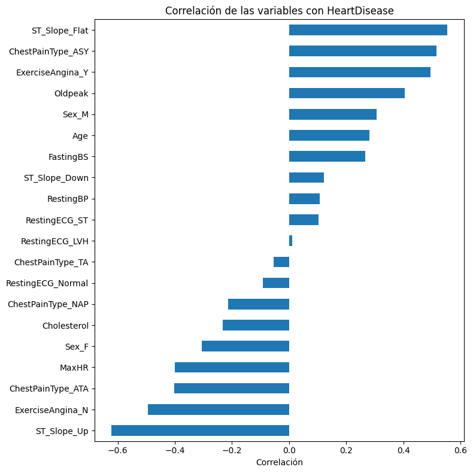
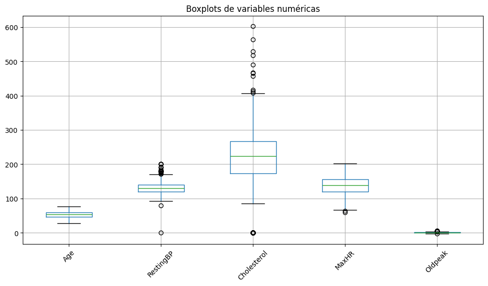

# Informe - Parte 1: Análisis de la base de datos

## Trabajo Práctico - Matemática III

**Tema:** Redes neuronales  
**Dataset:** Heart Failure Prediction  
**Fuente:** https://www.kaggle.com/datasets/fedesoriano/heart-failure-prediction  
**Integrantes:** Micaela Ortiz y Camila Maldonado.

## Introducción

Para este trabajo se eligió la base de datos **Heart Failure Prediction**, disponible en Kaggle. Se trata de una base de datos real relacionada con pacientes y enfermedad cardíaca.

El objetivo de esta primera parte es analizar la base antes de utilizarla para entrenar una red neuronal de clasificación. En particular, se busca describir las variables, estudiar su relación con la variable objetivo, detectar posibles valores atípicos o inconsistentes y definir una estrategia de normalización.

## Descripción general del dataset

La base contiene **918 registros** y **12 columnas**. Cada fila representa un paciente. Las columnas contienen variables clínicas y demográficas, como edad, sexo, tipo de dolor de pecho, presión arterial en reposo, colesterol, frecuencia cardíaca máxima y otras mediciones asociadas.

La variable objetivo es `HeartDisease`, que toma dos valores posibles:

- `0`: ausencia de enfermedad cardíaca.
- `1`: presencia de enfermedad cardíaca.

Por este motivo, el problema corresponde a una **clasificación binaria**, ya que el modelo deberá predecir una de dos clases posibles.

La distribución de la variable objetivo es relativamente balanceada:

| Clase | Significado | Cantidad | Porcentaje |
|---|---|---:|---:|
| 0 | Sin enfermedad cardíaca | 410 | 44.66% |
| 1 | Con enfermedad cardíaca | 508 | 55.34% |

No se observan valores faltantes explícitos, ya que todas las columnas tienen 918 valores no nulos. Sin embargo, en el resumen estadístico aparecen valores mínimos iguales a 0 en variables como `RestingBP` y `Cholesterol`, que deberán analizarse porque podrían representar datos inválidos o faltantes codificados como cero.

## (a) Descripción de las columnas

| Columna | Tipo | Descripción |
|---|---|---|
| `Age` | Numérica | Edad del paciente en años. |
| `Sex` | Categórica | Sexo del paciente: `M` masculino, `F` femenino. |
| `ChestPainType` | Categórica | Tipo de dolor de pecho. Los valores posibles son `TA`, `ATA`, `NAP` y `ASY`. |
| `RestingBP` | Numérica | Presión arterial en reposo. |
| `Cholesterol` | Numérica | Nivel de colesterol sérico. |
| `FastingBS` | Binaria | Indica si el nivel de azúcar en sangre en ayunas supera 120 mg/dl: `1` sí, `0` no. |
| `RestingECG` | Categórica | Resultado del electrocardiograma en reposo. Los valores posibles son `Normal`, `ST` y `LVH`. |
| `MaxHR` | Numérica | Frecuencia cardíaca máxima alcanzada. |
| `ExerciseAngina` | Binaria/categórica | Indica si hubo angina inducida por ejercicio: `Y` sí, `N` no. |
| `Oldpeak` | Numérica | Depresión del segmento ST inducida por ejercicio en comparación con el reposo. |
| `ST_Slope` | Categórica | Pendiente del segmento ST durante el ejercicio. Los valores posibles son `Up`, `Flat` y `Down`. |
| `HeartDisease` | Binaria | Variable objetivo. `1` indica presencia de enfermedad cardíaca y `0` ausencia. |

## (b) Correlación de las características con la salida

Para analizar la relación entre las variables de entrada y la variable objetivo `HeartDisease`, primero se transformaron las variables categóricas mediante **one-hot encoding**. Esto permite representar cada categoría como una variable binaria y calcular su correlación con la salida.

Las correlaciones más relevantes observadas fueron:

| Variable | Correlación con `HeartDisease` | Interpretación |
|---|---:|---|
| `ST_Slope_Up` | -0.622 | Se asocia fuertemente con ausencia de enfermedad cardíaca. |
| `ST_Slope_Flat` | 0.554 | Se asocia con presencia de enfermedad cardíaca. |
| `ChestPainType_ASY` | 0.517 | El tipo de dolor asintomático aparece asociado a casos positivos. |
| `ExerciseAngina_Y` | 0.494 | La angina inducida por ejercicio se asocia con enfermedad cardíaca. |
| `Oldpeak` | 0.404 | Valores mayores tienden a asociarse con enfermedad cardíaca. |
| `MaxHR` | -0.400 | Una frecuencia cardíaca máxima mayor tiende a asociarse con ausencia de enfermedad. |
| `ChestPainType_ATA` | -0.402 | Este tipo de dolor aparece asociado a menor presencia de enfermedad cardíaca. |
| `Sex_M` | 0.305 | En esta base, el sexo masculino tiene correlación positiva con la salida. |
| `Age` | 0.282 | La edad presenta una correlación positiva moderada con la enfermedad cardíaca. |
| `FastingBS` | 0.267 | El azúcar en sangre en ayunas elevado se asocia moderadamente con casos positivos. |

A partir de este análisis, las variables que parecen más influyentes son `ST_Slope`, `ChestPainType`, `ExerciseAngina`, `Oldpeak` y `MaxHR`. En cambio, variables como `RestingECG_LVH`, `RestingBP` y `RestingECG_ST` presentan correlaciones más bajas, por lo que parecen aportar menos información de forma individual.

De todos modos, no se deberían descartar variables únicamente por una correlación baja, ya que una red neuronal puede aprender relaciones no lineales o combinaciones entre variables. Por ese motivo, para un primer modelo conviene conservar la mayoría de las columnas, luego evaluar el desempeño y recién después considerar una selección de características.



## (c) Adecuación de la base para una red neuronal de clasificación binaria

Esta base de datos es adecuada para entrenar una red neuronal de clasificación binaria porque contiene una variable objetivo binaria, `HeartDisease`, y varias variables de entrada que describen características clínicas y demográficas de cada paciente.

El modelo intentará predecir si un paciente presenta enfermedad cardíaca o no. Es decir:

- Entrada del modelo: variables como edad, sexo, tipo de dolor de pecho, presión arterial, colesterol, frecuencia cardíaca máxima, entre otras.
- Salida del modelo: valor de `HeartDisease`, donde `1` indica presencia de enfermedad cardíaca y `0` indica ausencia.

La base tiene 918 registros, una cantidad suficiente para construir un modelo inicial. Además, la distribución de clases no está extremadamente desbalanceada: aproximadamente el 55.34% de los registros corresponden a pacientes con enfermedad cardíaca y el 44.66% a pacientes sin enfermedad.

Antes de entrenar la red neuronal, será necesario transformar las variables categóricas a formato numérico y normalizar las variables numéricas para que todas tengan escalas comparables.

## (d) Identificación de datos atípicos y limpieza

Para identificar posibles datos atípicos se analizaron dos aspectos: valores iguales a cero en variables donde podrían no tener sentido clínico, y detección de atípicos mediante el método del rango intercuartílico (IQR).

En primer lugar, se encontraron los siguientes valores iguales a cero:

| Variable | Cantidad de valores 0 | Observación |
|---|---:|---|
| `RestingBP` | 1 | Una presión arterial en reposo igual a 0 no es un valor clínicamente válido. |
| `Cholesterol` | 172 | Un colesterol igual a 0 probablemente representa datos faltantes o no medidos. |
| `MaxHR` | 0 | No presenta valores cero. |
| `Oldpeak` | 368 | En este caso el valor 0 sí puede ser válido, porque indica ausencia de depresión del segmento ST. |

Luego se aplicó el método IQR sobre las variables numéricas:

| Variable | Límite inferior | Límite superior | Cantidad de atípicos |
|---|---:|---:|---:|
| `Age` | 27.50 | 79.50 | 0 |
| `RestingBP` | 90.00 | 170.00 | 28 |
| `Cholesterol` | 32.62 | 407.62 | 183 |
| `MaxHR` | 66.00 | 210.00 | 2 |
| `Oldpeak` | -2.25 | 3.75 | 16 |



A partir de estos resultados, se observa que `RestingBP` y `Cholesterol` requieren especial atención. En particular, los valores iguales a cero no parecen representar mediciones reales, sino datos inválidos o faltantes codificados como cero.

La estrategia de limpieza y selección de características propuesta es:

- Eliminar la columna `Cholesterol`, ya que contiene 172 valores iguales a cero, equivalentes aproximadamente al 18.7% del dataset.
- Eliminar la columna `RestingBP`, ya que además de presentar un valor imposible igual a cero, mostró una correlación baja con la variable objetivo (`0.108`).
- Conservar `Oldpeak = 0`, ya que es un valor válido dentro del significado de la variable.
- No eliminar automáticamente todos los valores atípicos detectados por IQR, porque algunos pueden corresponder a pacientes reales con valores clínicos extremos.
- Seleccionar para el entrenamiento inicial las variables que mostraron mayor relación con la salida: `ST_Slope`, `ChestPainType`, `ExerciseAngina`, `Oldpeak`, `MaxHR` y `Age`.

Se decide eliminar `Cholesterol` porque un colesterol igual a cero no es clínicamente posible en un paciente vivo. Por lo tanto, esos valores probablemente representan datos faltantes o no medidos. Como hay 172 registros con este problema, eliminar las filas implicaría perder una parte importante de la base. Reemplazarlos por la mediana también podría introducir una distorsión considerable, ya que afectaría a una proporción alta de la columna. Por ese motivo, se opta por descartar la variable completa para el entrenamiento inicial.

En el caso de `RestingBP`, se detectó un único valor igual a cero, que tampoco es clínicamente válido. Si solo se considerara ese dato, podría reemplazarse por la mediana. Sin embargo, la variable presenta una correlación baja con `HeartDisease` (`0.108`), por lo que se decide no incluirla entre las características finales.

Además, se realiza una selección de variables para reducir la dimensionalidad del problema. Se conservan `ST_Slope`, `ChestPainType`, `ExerciseAngina`, `Oldpeak`, `MaxHR` y `Age`, porque fueron algunas de las variables con mayor correlación absoluta con la variable objetivo. También se conserva `HeartDisease` como variable de salida.

Con estas decisiones se mantienen las 918 filas originales y el dataset final queda reducido a 7 columnas: 6 variables de entrada y 1 variable objetivo. Esto permite trabajar con una entrada más simple para la red neuronal, evitando variables problemáticas o de menor relevancia individual.

## (e) Normalización de los datos

Antes de entrenar una red neuronal, es necesario transformar las variables para que todas puedan ser utilizadas como entradas numéricas del modelo.

Luego de la selección de características, el dataset quedó compuesto por 6 variables de entrada (`ST_Slope`, `ChestPainType`, `ExerciseAngina`, `Oldpeak`, `MaxHR` y `Age`) y una variable objetivo (`HeartDisease`).

En primer lugar, las variables categóricas seleccionadas (`ST_Slope`, `ChestPainType` y `ExerciseAngina`) se transformaron mediante **one-hot encoding**. Este procedimiento crea una columna binaria para cada categoría posible. Por ejemplo, la variable `ExerciseAngina`, que originalmente contiene los valores `Y` y `N`, se transforma en columnas numéricas que indican la presencia o ausencia de cada categoría.

Luego, se normalizaron las variables numéricas seleccionadas: `Oldpeak`, `MaxHR` y `Age`.

El método elegido fue la **estandarización Z-score**, definida como:

```text
z = (x - media) / desvío estándar
```

Se eligió este método porque las variables numéricas están en escalas distintas. Por ejemplo, `MaxHR` toma valores mucho más grandes que `Oldpeak`, y si no se normalizan, la red neuronal podría darle más peso a algunas variables solo por su escala numérica.

Después de aplicar la estandarización, las variables numéricas quedaron con media cercana a 0 y desvío estándar cercano a 1:

| Variable | Media luego de normalizar | Desvío estándar luego de normalizar |
|---|---:|---:|
| `Oldpeak` | 0.00 | 1.00 |
| `MaxHR` | 0.00 | 1.00 |
| `Age` | -0.00 | 1.00 |

Esto favorece el entrenamiento de la red neuronal, especialmente cuando se utiliza descenso por gradiente, ya que las variables quedan en escalas comparables.