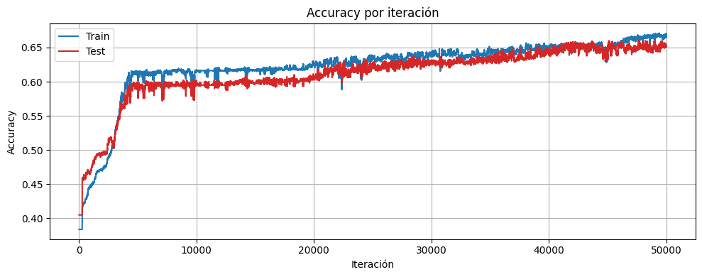
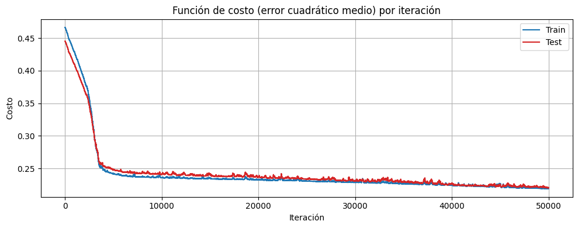
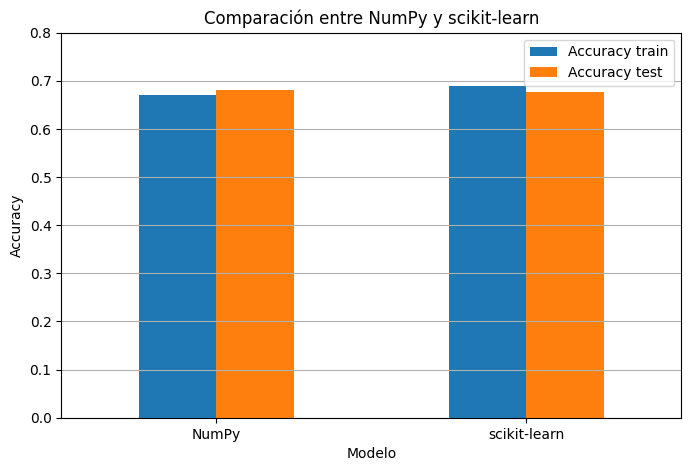
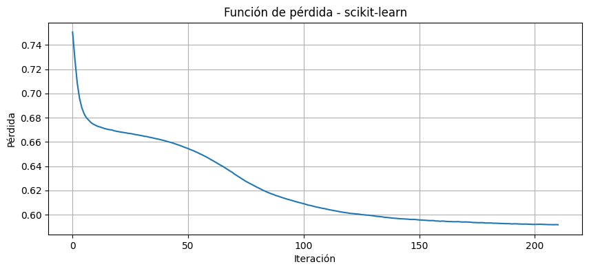
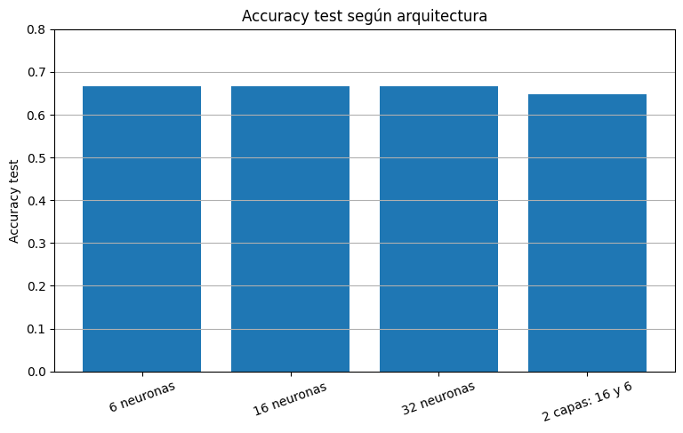

# Informe — Parte 1: Análisis de la base de datos

**Trabajo Práctico — Matemática III: Redes Neuronales**  
**Dataset:** Water Potability  
**Fuente:** https://www.kaggle.com/datasets/adityakadiwal/water-potability  
**Integrantes:** Micaela Ortiz y Camila Maldonado

---

## Introducción

Se eligió la base de datos **Water Potability**, disponible en Kaggle. Contiene mediciones físico-químicas de muestras de agua y una variable objetivo binaria que indica si el agua es apta para el consumo humano. El objetivo de esta primera parte es analizar el dataset antes de utilizarlo para entrenar una red neuronal de clasificación: describir las variables, estudiar su relación con la variable objetivo, detectar outliers y valores faltantes, y definir una estrategia de normalización.

El dataset contiene **3.276 registros** y **10 columnas**: 9 variables de entrada numéricas y 1 variable objetivo binaria.

---

## (a) Descripción de las columnas

Todas las variables de entrada son **numéricas continuas** de tipo `float64`. No hay variables categóricas ni de texto, por lo que no fue necesario aplicar ningún tipo de codificación (como one-hot encoding).

| Columna | Tipo | Descripción |
|---|---|---|
| `ph` | Numérica continua | Nivel de pH del agua. Rango teórico: 0 a 14. El rango seguro según la OMS para agua potable es entre 6.5 y 8.5. Tiene **491 valores faltantes**. |
| `Hardness` | Numérica continua | Dureza del agua en mg/L. Mide la cantidad de calcio y magnesio disueltos. Sin valores faltantes. |
| `Solids` | Numérica continua | Sólidos totales disueltos en ppm. Es la variable con mayor magnitud numérica del dataset (valores en el orden de los miles). Sin valores faltantes. |
| `Chloramines` | Numérica continua | Concentración de cloraminas en ppm. Se usan como desinfectante en el tratamiento del agua. Sin valores faltantes. |
| `Sulfate` | Numérica continua | Concentración de sulfatos en mg/L. Tiene **781 valores faltantes**, la mayor cantidad del dataset (23.84%). |
| `Conductivity` | Numérica continua | Conductividad eléctrica del agua en μS/cm. Indica la cantidad de iones disueltos. Sin valores faltantes. |
| `Organic_carbon` | Numérica continua | Carbono orgánico total en ppm. Mide la cantidad de compuestos orgánicos presentes en el agua. Sin valores faltantes. |
| `Trihalomethanes` | Numérica continua | Concentración de trihalometanos en μg/L. Son subproductos del proceso de desinfección del agua. Tiene **162 valores faltantes**. |
| `Turbidity` | Numérica continua | Turbidez del agua en NTU. Mide la claridad del agua. Sin valores faltantes. |
| `Potability` | Binaria (target) | Variable objetivo. `1` indica agua potable y `0` indica agua no potable. |

La distribución de la variable objetivo es la siguiente:

| Clase | Significado | Cantidad | Porcentaje |
|---|---|---:|---:|
| 0 | No potable | 1998 | 60.99% |
| 1 | Potable | 1278 | 39.01% |

Existe un leve desbalance de clases (61% / 39%). Este desbalance es moderado y no representa un problema crítico para el entrenamiento, ya que ambas clases tienen representación suficiente. Aun así, conviene tener en cuenta este desbalance al interpretar la accuracy del modelo: un clasificador trivial que prediga siempre "no potable" obtendría un 61% de accuracy sin haber aprendido nada, por lo que se espera que el modelo supere ese valor.

---

## (b) Correlación de las características con la salida

Para analizar la relación entre las variables de entrada y la variable objetivo se utilizaron dos enfoques complementarios: la **correlación de Pearson** y la **información mutua**.

Antes del cálculo, los valores faltantes fueron imputados con la mediana de cada columna (ver sección d).

### Correlación de Pearson

El coeficiente de Pearson mide la relación **lineal** entre dos variables. Toma valores entre -1 y 1, donde valores cercanos a 0 indican ausencia de relación lineal.

| Variable | Correlación con `Potability` |
|---|---:|
| `Solids` | 0.034 |
| `Chloramines` | 0.024 |
| `Trihalomethanes` | 0.007 |
| `Turbidity` | 0.002 |
| `ph` | -0.003 |
| `Conductivity` | -0.008 |
| `Hardness` | -0.014 |
| `Sulfate` | -0.020 |
| `Organic_carbon` | -0.030 |

Ninguna variable presenta una correlación lineal significativa con la variable objetivo. Todos los valores se encuentran entre -0.03 y 0.03.

### Información mutua

Dado que las correlaciones lineales son todas prácticamente nulas, se complementó el análisis con la **información mutua**, que detecta relaciones no lineales entre variables. Un valor de 0 indica independencia estadística; valores mayores indican mayor dependencia.

| Variable | Información mutua |
|---|---:|
| `Hardness` | 0.0266 |
| `Conductivity` | 0.0071 |
| `Organic_carbon` | 0.0040 |
| `Turbidity` | 0.0031 |
| `Sulfate` | 0.0024 |
| `Solids` | 0.0011 |
| `ph` | 0.0002 |
| `Chloramines` | 0.0000 |
| `Trihalomethanes` | 0.0000 |

Los valores de información mutua también son muy bajos en todas las variables. `Hardness` es la que presenta la mayor dependencia con `Potability`, aunque sigue siendo un valor muy pequeño.

### Interpretación

Ninguna variable individual se destaca como claramente influyente sobre la potabilidad, ni de forma lineal ni no lineal. Esto no significa que las variables sean irrelevantes: lo que indica es que la relación entre las propiedades físico-químicas y la potabilidad es **compleja y multivariada**, es decir, depende de la combinación de varias variables simultáneamente y no de ninguna en particular. Esta característica es precisamente la que justifica el uso de una red neuronal, que es capaz de capturar ese tipo de interacciones no lineales entre variables.

También se verificó que las variables de entrada son prácticamente independientes entre sí: el único par con correlación superior a 0.10 es `Solids` y `Sulfate` (r = -0.15), lo que confirma que no hay redundancia significativa en el dataset y que todas las columnas aportan información distinta.

---

## (c) Factibilidad para una red neuronal de clasificación binaria

**¿Es esta base de datos adecuada?**

Sí, el dataset es adecuado por varias razones:

- La variable objetivo `Potability` es estrictamente binaria (valores 0 y 1), lo que se alinea directamente con la arquitectura de una red neuronal de clasificación binaria con una sola neurona de salida y función de activación sigmoide.
- Todas las variables de entrada son numéricas continuas, lo que facilita el preprocesamiento (no requiere codificación) y es compatible con cualquier arquitectura de red neuronal.
- El dataset contiene datos reales de mediciones físico-químicas, lo que garantiza que los patrones aprendidos correspondan a relaciones reales del mundo.
- Aunque las correlaciones individuales con la variable objetivo son bajas, esto no invalida el dataset: una red neuronal puede capturar relaciones no lineales y combinaciones entre variables que métodos lineales no detectan.

**¿Qué intentará predecir el modelo?**

El modelo recibirá como entrada las 9 mediciones físico-químicas de una muestra de agua y producirá como salida un valor entre 0 y 1 que representa la probabilidad de que esa muestra sea potable. Si el valor supera 0.5 se clasifica como potable (1); de lo contrario, como no potable (0).

**¿Cuál es el objetivo?**

Construir un clasificador que, a partir de mediciones físico-químicas, determine si una muestra de agua es apta para el consumo humano. Este tipo de modelo tiene aplicación real en sistemas de monitoreo de calidad del agua en plantas de tratamiento o redes de distribución.

---

## (d) Identificación de datos atípicos y limpieza

### Valores faltantes

Se detectaron valores faltantes en tres columnas:

| Variable | Valores faltantes | Porcentaje |
|---|---:|---:|
| `ph` | 491 | 14.99% |
| `Sulfate` | 781 | 23.84% |
| `Trihalomethanes` | 162 | 4.95% |

Se decidió **imputar estos valores con la mediana de cada columna** en lugar de eliminar las filas correspondientes. Eliminar las filas implicaría perder hasta un 24% del dataset, lo que reduciría significativamente la cantidad de datos disponibles para el entrenamiento. Se eligió la **mediana** en lugar del promedio porque es más robusta ante la presencia de outliers: no se ve afectada por valores extremos como sí lo hace la media.

Luego de la imputación, el dataset quedó sin valores faltantes en ninguna columna.

### Detección de outliers

Se aplicó el método del **rango intercuartílico (IQR)** para detectar outliers. Este método define los límites fuera de los cuales un valor se considera atípico:

- Límite inferior = Q1 − 1.5 × IQR  
- Límite superior = Q3 + 1.5 × IQR

donde Q1 es el percentil 25, Q3 el percentil 75 e IQR = Q3 − Q1.

Los resultados fueron:

| Variable | Límite inferior | Límite superior | Outliers detectados | % del total |
|---|---:|---:|---:|---:|
| `ph` | 3.89 | 10.26 | 142 | 4.3% |
| `Hardness` | 117.13 | 276.39 | 83 | 2.5% |
| `Solids` | −1832.42 | 44831.87 | 47 | 1.4% |
| `Chloramines` | 3.15 | 11.10 | 61 | 1.9% |
| `Sulfate` | 267.16 | 400.32 | 264 | 8.1% |
| `Conductivity` | 191.65 | 655.88 | 11 | 0.3% |
| `Organic_carbon` | 5.33 | 23.30 | 25 | 0.8% |
| `Trihalomethanes` | 26.62 | 106.70 | 54 | 1.6% |
| `Turbidity` | 1.85 | 6.09 | 19 | 0.6% |

**¿Es necesario limpiarlos?**

Se decidió **no eliminar** los outliers por las siguientes razones:

1. Representan mediciones físico-químicas reales que pueden ocurrir naturalmente en distintas fuentes de agua. Un agua con pH extremo, alta concentración de sulfatos o muchos sólidos disueltos es perfectamente posible en la naturaleza y no indica un error de medición.
2. La variable más afectada es `Sulfate` con un 8.1% de outliers, y el resto no supera el 5%. Eliminar todas las filas con outliers implicaría descartar una proporción significativa del dataset.
3. La normalización Z-score aplicada en la sección siguiente reduce el impacto de estos valores extremos, llevando todas las variables a una escala comparable sin eliminar información real.

---

## (e) Normalización de los datos

Dado que todas las variables de entrada son numéricas con escalas muy distintas entre sí, es necesario normalizarlas antes del entrenamiento. Por ejemplo, `Solids` toma valores en el orden de los miles mientras que `Turbidity` toma valores menores a 7. Sin normalización, la red neuronal podría asignarle mayor importancia a variables con mayor magnitud numérica aunque no sean más relevantes para la predicción. Además, la normalización facilita la convergencia del algoritmo de descenso por gradiente.

**La variable objetivo `Potability` no se normaliza**, ya que es binaria (0 o 1) y cumple su función directamente como etiqueta de clase.

### Método elegido: estandarización Z-score

Se aplicó la estandarización Z-score a las 9 variables de entrada mediante la fórmula:

z = (x − μ) / σ

donde μ es la media y σ el desvío estándar de cada columna. Este método transforma cada variable para que quede con **media 0 y desvío estándar 1**.

Se eligió Z-score en lugar de Min-Max por dos razones:

1. El dataset presenta outliers en todas las columnas. El método Min-Max es muy sensible a valores extremos: al comprimir todos los valores al rango [0, 1], los outliers distorsionan la escala de toda la columna. El Z-score en cambio reescala los valores manteniendo la distribución original.
2. El Z-score es el método recomendado para redes neuronales entrenadas con descenso por gradiente, porque produce entradas centradas en cero, lo que favorece la estabilidad numérica del entrenamiento.

### División del dataset

Antes del entrenamiento, el dataset se dividirá en conjunto de entrenamiento (70%) y conjunto de prueba (30%), utilizando una semilla fija (`random_state=1`) para que la división sea reproducible. Esta división se realizará en la Parte 2.

### Resultado final

Luego del preprocesamiento, las 9 variables de entrada quedan con media ≈ 0 y desvío estándar = 1. La matriz de entrada X tiene shape **(3276, 9)** y la variable objetivo y tiene shape **(3276, 1)**. El dataset queda listo para el entrenamiento de la red neuronal.

## -------------------------------------------

# Parte 2: Red neuronal con NumPy

## Objetivo

En esta parte se implementó una red neuronal de clasificación binaria utilizando únicamente `numpy`. El objetivo del modelo es predecir la variable `Potability`, que indica si una muestra de agua es potable (`1`) o no potable (`0`).

## (a) Arquitectura de la red

La red neuronal implementada tiene una arquitectura feedforward con una capa oculta y una capa de salida.

| Capa | Cantidad de neuronas | Función de activación |
|---|---:|---|
| Entrada | 9 | No aplica |
| Capa oculta | 6 | ReLU |
| Salida | 1 | Sigmoide |

La capa de entrada tiene 9 neuronas porque el dataset contiene 9 variables físico-químicas utilizadas como características de entrada: `ph`, `Hardness`, `Solids`, `Chloramines`, `Sulfate`, `Conductivity`, `Organic_carbon`, `Trihalomethanes` y `Turbidity`.

Se eligió una capa oculta de 6 neuronas como un valor intermedio entre las 9 entradas y la única salida. Esta cantidad permite que la red pueda capturar relaciones no lineales entre las variables sin agregar complejidad innecesaria que aumente el riesgo de sobreajuste.

La función de activación utilizada en la capa oculta fue ReLU:

ReLU(x) = max(0, x)

Esta función introduce no linealidad en el modelo, lo que le permite aprender relaciones que no podrían capturarse con un modelo lineal. Además, evita el problema del gradiente desvaneciente que aparece con funciones como la sigmoide en capas ocultas.

La capa de salida tiene una única neurona con función sigmoide:

sigmoide(x) = 1 / (1 + e^(-x))

La sigmoide devuelve un valor entre 0 y 1, interpretable como la probabilidad de que la muestra sea potable. Para obtener la clase final, se utiliza un umbral de 0.5.

## (b) Implementación con NumPy

La red fue implementada manualmente utilizando NumPy. El procedimiento seguido fue:

1. Inicialización aleatoria de pesos y sesgos.
2. Propagación hacia adelante para calcular la salida de la red.
3. Cálculo de la función de costo.
4. Retropropagación para calcular los gradientes.
5. Actualización de pesos y sesgos mediante descenso por gradiente estocástico.

Antes del entrenamiento, los valores faltantes de las columnas `ph`, `Sulfate` y `Trihalomethanes` fueron completados con la mediana de cada columna. Se eligió la mediana porque es menos sensible a valores extremos que la media.

Luego, las variables de entrada fueron normalizadas mediante Z-score:

z = (x - media) / desvío estándar

Esto permite que todas las variables queden en escalas comparables, lo cual es importante para el entrenamiento de una red neuronal.

El dataset fue dividido en 70% para entrenamiento y 30% para prueba, utilizando una semilla fija (`random_state=1`) para que la división sea reproducible.

La tasa de aprendizaje utilizada fue:

L = 0.005

Inicialmente se probaron valores mayores, pero una tasa de aprendizaje menor permitió un entrenamiento más estable. La red fue entrenada durante 50000 iteraciones.

La función de costo utilizada fue el error cuadrático por muestra:

C = (y_predicho - y_real)²

Como el entrenamiento se realiza con descenso por gradiente estocástico (una muestra por iteración), la función de costo se calcula sobre un solo dato en cada paso.

## (c) Entrenamiento y curvas de rendimiento

Durante el entrenamiento se registraron la accuracy y la función de costo tanto para el conjunto de entrenamiento como para el conjunto de prueba.

Los resultados finales obtenidos fueron:

| Métrica | Valor |
|---|---:|
| Accuracy train | 0.6677 |
| Accuracy test | 0.6521 |

La accuracy de entrenamiento es levemente mayor que la de prueba, lo que es coherente con un modelo que aprende sin sobreajustarse de forma marcada. La diferencia entre ambas es de apenas 1.5 puntos, lo que indica que el modelo generaliza correctamente a datos que no vio durante el entrenamiento.

Además, la red superó al modelo base que predice siempre la clase mayoritaria (60.99% de accuracy si predice "no potable" para todos los casos). Esto indica que el modelo logró aprender ciertos patrones de los datos, aunque la mejora fue moderada.

El rendimiento no alcanzó valores muy altos, lo cual es coherente con el análisis exploratorio realizado en la Parte 1. Las variables físico-químicas presentan correlaciones bajas con `Potability`, por lo que no existe una separación clara entre las clases.

## (d) Análisis de overfitting

A partir de las curvas obtenidas, no se observa un sobreajuste marcado. La accuracy de entrenamiento y la de prueba se mantienen en valores cercanos a lo largo del entrenamiento, con una diferencia muy pequeña al final.

El costo disminuye a lo largo de las iteraciones, lo que muestra que la red va ajustando sus parámetros durante el entrenamiento. Sin embargo, las curvas presentan oscilaciones porque la actualización de pesos se realiza utilizando muestras aleatorias del conjunto de entrenamiento (descenso por gradiente estocástico puro).

Para detectar overfitting durante el entrenamiento se puede observar cuándo la accuracy de prueba deja de mejorar mientras la de entrenamiento sigue subiendo, o cuando el costo de prueba empieza a crecer mientras el de entrenamiento sigue bajando. En este caso, ese fenómeno no aparece de forma clara: ambas curvas evolucionan juntas durante todo el entrenamiento.

Si llegara a aparecer overfitting, se podría manejar de varias formas: utilizando una arquitectura más simple (menos neuronas), aplicando early stopping (detener el entrenamiento cuando la accuracy de prueba deja de mejorar), o incorporando técnicas de regularización.

También se probaron distintas configuraciones modificando la cantidad de neuronas, la tasa de aprendizaje y la proporción de datos usada para entrenamiento y prueba. Finalmente se mantuvo una arquitectura simple con 6 neuronas ocultas, ya que permitió obtener un rendimiento razonable sin aumentar innecesariamente la complejidad del modelo.

En conclusión, la red neuronal implementada en NumPy logró aprender de manera moderada. El rendimiento obtenido sugiere que el problema de clasificación no es trivial y que las variables disponibles no separan con mucha claridad las muestras potables de las no potables.

## -------------------------------------------

# Parte 3: Comparación con scikit-learn

## Objetivo

En esta parte se implementó una red neuronal utilizando `scikit-learn` para comparar su rendimiento con la red implementada manualmente en `numpy`.

## (a) Implementación con scikit-learn

Se utilizó `MLPClassifier` para construir una red neuronal con una arquitectura similar a la desarrollada en la Parte 2.

| Capa | Cantidad de neuronas | Función de activación |
|---|---:|---|
| Entrada | 9 | No aplica |
| Capa oculta | 6 | ReLU |
| Salida | 1 | Sigmoide |

Se aplicó el mismo preprocesamiento que en la Parte 2: imputación de valores faltantes con la mediana, normalización Z-score y separación entre entrenamiento y prueba con `test_size=0.30` y `random_state=1`.

El conjunto de entrenamiento quedó formado por 2293 muestras y el conjunto de prueba por 983 muestras.

## (b) Comparación de rendimiento

Los resultados obtenidos fueron:

| Modelo | Accuracy train | Accuracy test |
|---|---:|---:|
| NumPy | 0.6677 | 0.6521 |
| scikit-learn | 0.6812 | 0.6663 |

Ambos modelos utilizan una arquitectura similar, con una capa oculta de 6 neuronas y función de activación ReLU. La implementación con `scikit-learn` obtuvo una accuracy levemente mayor tanto en entrenamiento como en prueba, pero la diferencia es pequeña (alrededor de 1.5 puntos en ambos conjuntos).

Esta diferencia puede explicarse porque, aunque las dos redes tienen una arquitectura similar, las implementaciones no son idénticas. La red desarrollada manualmente en `numpy` utiliza una implementación más simple del entrenamiento, mientras que `scikit-learn` utiliza procedimientos internos más optimizados (por ejemplo, una mejor inicialización de pesos y una función de pérdida específica para clasificación binaria).

De todos modos, la cercanía entre ambos resultados indica que la red manual logró un rendimiento competitivo respecto a una implementación ya optimizada.

La implementación manual en `numpy` permite comprender mejor el funcionamiento interno de la red neuronal, ya que requiere programar la propagación hacia adelante, la retropropagación y la actualización de pesos. En cambio, `scikit-learn` permite construir y entrenar redes neuronales de forma más simple y rápida.

La curva de pérdida del modelo implementado con `scikit-learn` muestra una disminución progresiva del error durante el entrenamiento:

## (c) Prueba de otras arquitecturas

También se probaron distintas arquitecturas modificando la cantidad de neuronas y capas ocultas. Los resultados fueron:

| Arquitectura | Accuracy train | Accuracy test |
|---|---:|---:|
| 6 neuronas | 0.6812 | 0.6663 |
| 16 neuronas | 0.7034 | 0.6663 |
| 32 neuronas | 0.7427 | 0.6653 |
| 2 capas: 16 y 6 | 0.7226 | 0.6480 |

La arquitectura con 6 neuronas en una capa oculta fue tomada como referencia porque coincide con la arquitectura implementada manualmente en `numpy`. Además, mantiene una cantidad reducida de parámetros, lo cual es conveniente para evitar aumentar innecesariamente la complejidad del modelo.

Al probar arquitecturas más grandes, se observa un patrón claro: **la accuracy de entrenamiento aumenta con la complejidad de la red, pero la accuracy de prueba no mejora e incluso empeora**. Por ejemplo, la red con 32 neuronas alcanza un 74.27% en entrenamiento pero solo un 66.53% en prueba, lo que muestra una brecha de casi 8 puntos. La arquitectura con dos capas (16 y 6 neuronas) presenta el mismo problema: alta accuracy en train pero la peor accuracy en test de todas las arquitecturas probadas.

Este comportamiento es un indicio claro de **sobreajuste**: las redes más complejas memorizan los datos de entrenamiento pero pierden capacidad de generalizar a datos nuevos.

En cambio, la red de 6 neuronas mantiene una brecha pequeña entre train y test (alrededor de 1.5 puntos), lo que indica que generaliza mejor a pesar de tener un rendimiento de entrenamiento más bajo.

A partir de estos resultados, se decidió mantener la arquitectura simple con 6 neuronas, ya que ofrece el mejor balance entre rendimiento y generalización.

En conclusión, `scikit-learn` facilita la implementación y comparación de distintas redes neuronales. Sin embargo, en este dataset las mejoras obtenidas al modificar la arquitectura son moderadas o incluso contraproducentes. Esto refuerza la idea observada en las partes anteriores: la potabilidad del agua no parece separarse fácilmente a partir de estas variables físico-químicas, por lo que aumentar la complejidad del modelo no se traduce en mejor rendimiento.

## -------------------------------------------

# Parte 4: Conclusión

A lo largo del trabajo se desarrolló el proceso completo de análisis, preparación, implementación y evaluación de una red neuronal de clasificación binaria. El objetivo fue predecir si una muestra de agua es potable o no a partir de variables físico-químicas del dataset **Water Potability**.

El análisis fue fundamental para tomar decisiones antes de entrenar el modelo. En primer lugar, permitió identificar que la base contenía 3276 registros, 9 variables de entrada numéricas y una variable objetivo binaria (`Potability`). También se detectó que algunas columnas tenían valores faltantes: `ph`, `Sulfate` y `Trihalomethanes`. En lugar de eliminar esas filas, se decidió imputar los valores faltantes con la mediana de cada columna, ya que eliminar registros habría reducido considerablemente la cantidad de datos disponibles. Esta decisión permitió conservar todo el dataset y evitar perder información útil.

Otro aspecto importante del análisis fue la detección de valores atípicos. Se encontraron valores atípicos en varias variables mediante el método IQR. Sin embargo, se decidió no eliminarlos automáticamente, porque se trata de mediciones físico-químicas que pueden corresponder a casos reales. En este contexto, un valor extremo no necesariamente representa un error, sino que puede describir una muestra de agua con características particulares. Por eso, se priorizó conservar los datos y aplicar normalización para reducir el impacto de las diferencias de escala.

La normalización también fue una decisión central. Las variables del dataset tienen escalas muy distintas: por ejemplo, `Solids` toma valores en el orden de los miles, mientras que `Turbidity` o `ph` tienen valores mucho más pequeños. Si no se normalizaban los datos, la red podía asignar mayor importancia a ciertas variables solo por su magnitud numérica. Por este motivo se aplicó estandarización Z-score, dejando las variables con media cercana a 0 y desvío estándar cercano a 1. Esto favorece el entrenamiento por descenso por gradiente.

El análisis de correlación mostró que ninguna variable individual tenía una relación fuerte con la variable objetivo. Las correlaciones fueron muy bajas, lo que indicó que el problema no era sencillo de resolver mediante relaciones lineales simples. Sin embargo, esto no invalidó el uso de una red neuronal, ya que este tipo de modelo puede aprender combinaciones no lineales entre variables. Esta observación también ayudó a interpretar los resultados obtenidos: el modelo logró superar el baseline de la clase mayoritaria, pero la mejora fue moderada.

Para el entrenamiento se dividió el dataset en un 70% para entrenamiento y un 30% para prueba, utilizando una semilla fija (`random_state=1`) para que la división fuera reproducible. Esta separación permitió evaluar el modelo sobre datos que no había visto durante el entrenamiento, lo que es fundamental para detectar si el modelo generaliza correctamente o si se está sobreajustando a los datos de entrenamiento.

En cuanto al diseño de la red, se eligió una arquitectura simple: 9 neuronas de entrada, una capa oculta con 6 neuronas y una neurona de salida. La cantidad de neuronas de entrada corresponde a las 9 variables físico-químicas del dataset. Para la capa oculta se utilizó ReLU, ya que introduce no linealidad en el modelo y evita el problema del gradiente desvaneciente, mientras que para la salida se utilizó sigmoide, adecuada para clasificación binaria porque comprime el resultado entre 0 y 1. La elección inicial de 6 neuronas se basó en tomar un valor intermedio entre las 9 entradas y la única salida, y la exploración posterior con `scikit-learn` confirmó que era una buena decisión: las arquitecturas más complejas presentaron mayor brecha entre la accuracy de entrenamiento y la de prueba, lo que indica sobreajuste, mientras que la red de 6 neuronas mantuvo una diferencia muy pequeña entre ambos conjuntos.

La implementación manual con `numpy` permitió consolidar los conceptos fundamentales del funcionamiento de una red neuronal. En particular, se trabajó con la inicialización de pesos y sesgos, la propagación hacia adelante, el cálculo de la función de costo, la retropropagación y la actualización de parámetros mediante descenso por gradiente estocástico. Implementar estos pasos manualmente permitió comprender cómo la red ajusta sus pesos a partir del error cometido.

La comparación con `scikit-learn` permitió observar las ventajas de utilizar una librería ya optimizada. Con `MLPClassifier` fue posible implementar una red similar con menos código y probar distintas arquitecturas de forma más rápida. Sin embargo, la implementación manual resultó más útil para comprender el proceso interno de aprendizaje. Ambas aproximaciones obtuvieron rendimientos similares (alrededor del 65-68% de accuracy en prueba), lo que indica que la implementación en `numpy` fue razonable.

En relación con el rendimiento, la red no obtuvo una accuracy extremadamente alta, pero sí superó el baseline de la clase mayoritaria. Esto indica que logró aprender ciertos patrones de los datos. Aun así, el rendimiento moderado refleja una limitación del dataset: las variables disponibles no separan claramente las clases potable y no potable. Por lo tanto, el resultado no debe interpretarse como un fracaso del modelo, sino como una característica del problema y de la información disponible. De hecho, al probar arquitecturas más grandes en la Parte 3, se observó que aumentar la complejidad no mejoraba la accuracy de prueba sino que la empeoraba, lo cual confirma que el límite está en los datos y no en la capacidad del modelo.

En conclusión, el trabajo permitió aplicar de manera integrada conceptos de análisis de datos, preprocesamiento, redes neuronales, entrenamiento, evaluación y comparación de modelos. También mostró que una buena implementación no garantiza necesariamente una accuracy alta si el dataset no contiene relaciones fuertes o fácilmente separables. El análisis exploratorio fue clave para tomar decisiones justificadas y para interpretar correctamente los resultados del modelo.